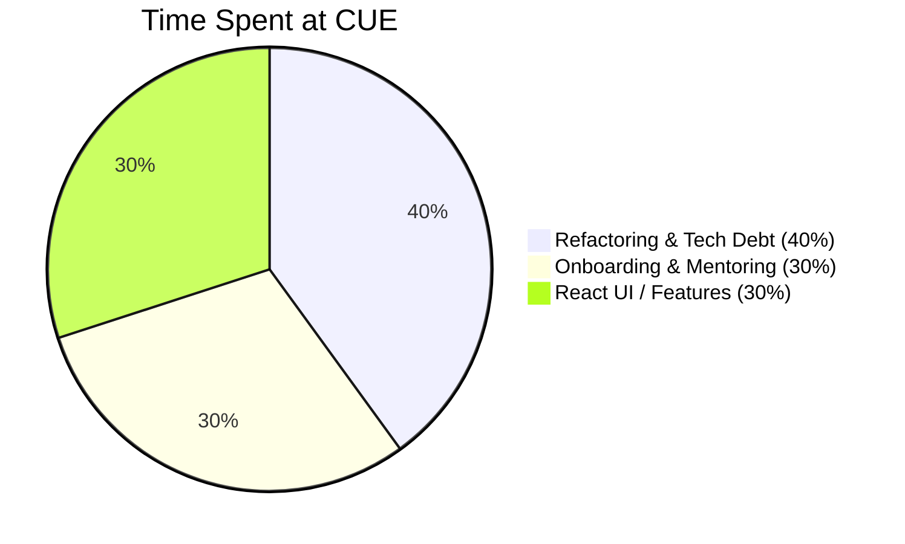

# CUE Post-Mortem

>  "I would certainly appreciate and will solicit your input on who we should be keeping around... I think that you are seeing the opportunity of being this very senior person [and] the advocate for tech debt on the team ... great talk, I feel like I learned a ton, so thank you for that -- I feel like I've been educated quite a bit, and this is exactly the kind of thing I want to get out of these kinds of conversations." [during a 1-on-1] 

— 🗣 [Bobby Wayne](https://www.linkedin.com/in/bobbywayne/), VP, Software Development at Cue Health `Aug 17, 2022` 

>  "Karl, a dev like you would be wanted anywhere. Thank you for all the help and mentorship. I learned a lot from you and already seen how much I've grown as an engineer, that's all thanks to you."

— 🗣 [Karun Narayan](https://www.linkedin.com/in/karun-narayan/), SDE at Cue `Oct 6, 2022` 

# **Table of Contents**

- [🕙 How I Spent My Time](https://github.com/charlieargue/CUE-code-samples#-how-i-spent-my-time)
- [💻 Code Samples](https://github.com/charlieargue/CUE-code-samples#-code-samples)
- [📚 Resources for Hi-Productivity and DX](https://github.com/charlieargue/CUE-code-samples#-resources-for-hi-productivity-and-DX)
- [🗣 Testimonials and Feedback](https://github.com/charlieargue/CUE-code-samples#-testimonials-and-feedback)
- [⭐️ UI Features / Highlights](https://github.com/charlieargue/CUE-code-samples#️-ui-features--highlights)

# 🕙 How I Spent My Time

# Code Samples

### Preparing for RTK-Q

* [**Re-usable Hooks:** DRY-ing and Hiding Implementation Details](Hooks.md)
* [**State Pyramid**: Making globalized state more muscular](State-Pyramid.md)

### RTK-Q Refactoring Journey

- [**Account Profile:** Removing Redux boilerplate and redundant state management](Account-Profile.md) 
- [**Live Visit Details:**  A more advanced RTK-Q refactoring example](Live-Visit-Details.md)
-  [**Advocate for Clean Code:** Guiding team to not over-engineer and take on tech debt unnecessarily](Clean-Code.md) 
-  [**Removing Thousands of Lines of Code:** and gaining functionality!](Removing-Code.md)
-  **Styleguide and Epic Kick-Off:** Started a style guide in the codebase and led the team thru my refactoring epic, here's [🎥 a short video](https://www.loom.com/share/cfa602e0bbc74e949d9a00efe4d2971e) that I made about that and sent out to the team.

# 📚 Resources for Hi-Productivity and DX

- [Typora](https://typora.io/) for editing markdown files 
- a [GitHub](https://github.com/) personal knowledge base 
- [Bookmarks Extension](https://marketplace.visualstudio.com/items?itemName=alefragnani.Bookmarks) for VS Code
- [Loom](https://loom.com/) for sharing and making sure I don't miss anything
- [CODDX](https://marketplace.visualstudio.com/items?itemName=coddx.coddx-alpha) personal Kanban board for VS Code

# 🗣 Testimonials and Feedback

### Technical / Architectural Impact

>  "I like the hooks thing in the PR you had... there is a definitely a lot of room for improvement, uh, around what we have now and, uh, this direction is, is definitely a good one." [my introduction of re-usable hooks for data-fetching and caching] 

— 🗣 [Maciej Ligenza](https://www.linkedin.com/in/maciej-ligenza-083bb12/), Staff Engineer at Treeline `Jun 20, 2022` 

>  "Thanks for the videos! these were super helpful... your [PR] code looks good!" 

— 🗣 Piotr Hasooni, Staff Engineer at Treeline `Aug 12, 2022` 

>  "Thanks Karl for all your help and awesome work looking into all the components and updating the tickets! Truly appreciate it! 
>
>  ... Terrific! Thank you so much for writing great examples for us to refer to! Appreciate that you pay attention to the details and offer suggestions for the naming conventions.
>
>  ... Thanks for reviewing my PR and adding valuable comments. 
>
>  ... Thanks Karl for adding more guidance and putting potential conflicts in thoughts! This is very helpful."

— 🗣 [Yi Angelov](https://www.linkedin.com/in/yi-angelov/), SDE at Treeline `September 2022` 

### Team Building

>  "As much energy I have, it is does not even come close to the passion and dedication you have for work. I gotta step up my game ...."

— 🗣  [Shaurya Kapoor](https://www.linkedin.com/in/skapoor831/), SDE at Cue `Aug 3, 2022` 

>  "And thanks, Karl. I know Karl's been helping a lot kind of with the more junior devs, getting them straightened out a little bit. So shout out to the Karl for being helpful and open to help with that kind of stuff."

— 🗣 [Summer Box](https://www.linkedin.com/in/summer-box-5a479920/), Software Development Manager at Cue `Jun 12, 2022` 

> "As the senior person there [on the team], they're really learning a lot from you, and they're really taking away a lot of the things that you bring to the table!"

— 🗣 [David Hendrickson](https://www.linkedin.com/in/david-hendrickson-667971102/), Director, Software Development at Cue `Aug 15, 2022` 

>  "And as always thank you for the feedback! It's nice having an outspoken senior dev"

— 🗣 [Summer Box](https://www.linkedin.com/in/summer-box-5a479920/), Software Development Manager at Cue `Jul 28, 2022` 

>  "Hey, thanks again for all the help. I'll try not to poke you too much but I might bother you a bit here and there because you were really really helpful."

— 🗣 [Doug Lloyd](https://www.linkedin.com/in/doug-lloyd-29b149186/), SDE at Cue `Jun 20, 2022` 

>  "Karl, a dev like you would be wanted anywhere. Thank you for all the help and mentorship. I learned a lot from you and already seen how much I've grown as an engineer, that's all thanks to you."

— 🗣 [Karun Narayan](https://www.linkedin.com/in/karun-narayan/), SDE at Cue `Oct 6, 2022` 

### Feedback from Supervisors

>  "Karl, just wanted to say thank you for stepping up right now! Your leadership is greatly appreciated" 

— 🗣 [Bobby Wayne](https://www.linkedin.com/in/bobbywayne/), VP, Software Development at Cue Health

>  "You're doing a great job and emerging as a leader on our nascent team!"

— 🗣 [David Hendrickson](https://www.linkedin.com/in/david-hendrickson-667971102/), Director, Software Development at Cue `Jun 11, 2022` 

>  "Huge thank you to Karl for tenaciously tracking down and resolving a p1 this evening!! Let's recap on Monday and see if there's anything we can do to avoid this issues from taking over anyone else's Friday night in the future." [during On-Call P1 issue] 

— 🗣 [Bobby Wayne](https://www.linkedin.com/in/bobbywayne/), VP, Software Development at Cue Health `Aug 8, 2022` 

>  "Again good work... Great work really chasing down the ticket! You both went above and beyond. Also don't hesitate when you were unsure to escalate and texting me was the right thing!" [during On-Call P1 issue] 

— 🗣 [Mark Adkins](https://www.linkedin.com/in/mark-adkins/), VP, Engineering at Treeline (Cue's team)  `Aug 8, 2022` 

>  "I would certainly appreciate and will solicit your input on who we should be keeping around... I think that you are seeing the opportunity of being this very senior person [and] the advocate for tech debt on the team ... great talk, I feel like I learned a ton, so thank you for that -- I feel like I've been educated quite a bit, and this is exactly the kind of thing I want to get out of these kinds of conversations." [during a 1-on-1] 

— 🗣 [Bobby Wayne](https://www.linkedin.com/in/bobbywayne/), VP, Software Development at Cue Health `Aug 17, 2022` 

# ⭐️ UI Features / Highlights

### **Patient Search**

### **Patient COVID Test History**

### **Patient COVID Test Details**

### **Patient Live Visit**

### **Loading Skeletons**

* [🎥 Short video](https://www.loom.com/share/0e7fdf4e39a849b7bb2771ef51ced92d) showing a better visual loading experience with skeletons that I introduced site-wide.

# ✉️ Contact Me

My personal website is https://karlgolka.com/ and you can email me at [contact@karlgolka.com](mailto:contact@karlgolka.com)

