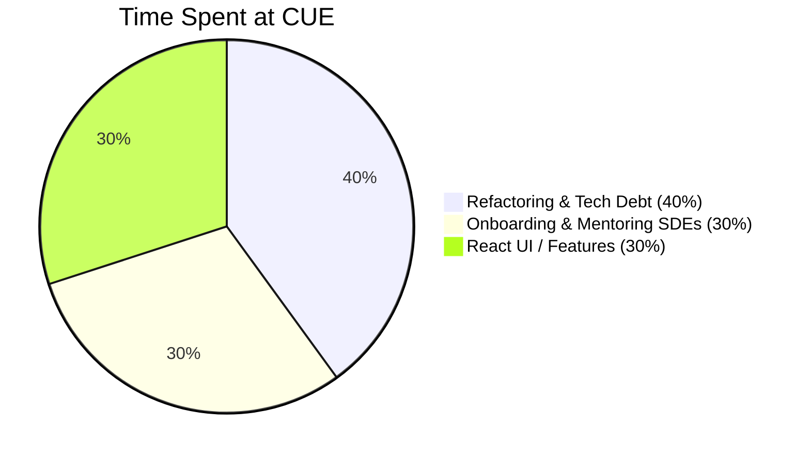

# CUE Post-Mortem


>  "I would certainly appreciate and will solicit your input on who we should be keeping around... I think that you are seeing the opportunity of being this very senior person [and] the advocate for tech debt on the team ... great talk, I feel like I learned a ton, so thank you for that -- I feel like I've been educated quite a bit, and this is exactly the kind of thing I want to get out of these kinds of conversations." [during a 1-on-1] 

— 🗣 [Bobby Wayne](https://www.linkedin.com/in/bobbywayne/), VP, Software Development at Cue Health `Aug 17, 2022` 


>  "Karl, a dev like you would be wanted anywhere. Thank you for all the help and mentorship. I learned a lot from you and already seen how much I've grown as an engineer, that's all thanks to you."

— 🗣 [Karun Narayan](https://www.linkedin.com/in/karun-narayan/), SDE at Cue `Oct 6, 2022` 


# **Table of Contents**

- [🕙 How I Spent My Time](https://github.com/charlieargue/CUE-code-samples#-how-i-spent-my-time)
- [💻 Code Samples](https://github.com/charlieargue/CUE-code-samples#-code-samples)
- [🗣 Testimonials and Feedback](https://github.com/charlieargue/CUE-code-samples#-testimonials-and-feedback)
- [⭐️ UI Features / Highlights](https://github.com/charlieargue/CUE-code-samples#️-ui-features--highlights)


# 🕙 How I Spent My Time




# Code Samples


### Preparing for RTK-Q

* [**Re-usable Hooks:** DRY-ing and Hiding the Implementation Details](Hooks.md)


### RTK-Q Refactoring Journey

- [**Account Profile:** Removing Redux boilerplate and redundant state management](Account-Profile.md) 
- 
- 
- 
- RTK-Q: show my typescript ==builder pattern==, yes!
- RTK-Q: big ==live visit one== (just after, yes I think! it'll be sanitized!)
- Account Profile.tsx (see below)
- show "what we were able ==to remove==", and maybe show as an example, one of the bad FILES we were entirely able to remove, like LV or something :), show some ==screen grabs of the GITHUB removal RED tags!!!!==💎
- show the ==useEffects== we removed!
- Show 👎 BEFORE & 👍 AFTER: `setUnreadMessages` b/c now using ==React.Context== here below


# State Mngmnt / RTK-Q and React.Context REFACTORING BEFORE & AFTER:

- [ ] **React.Context:** 👎 BEFORE & 👍 AFTER: 

  - [ ] ```js 
    EVERY LITTLE THING!
    👎 BEFORE & (for real! it almost looks like a joke ;)
    // setUnreadMessages: (state) => {
            //     if (state.twilioModal) {
            //         return {
            //             ...state,
            //             twilioModal: {
            //                 ...state.twilioModal,
            //                 unreadMessages: true,
            //             },
            //         };
            //     }
            // },
      
      
      
      👍 AFTER: 
    
    case 'setUnreadMessages': {
      return { ...state, unreadMessages: true };
    }
    ```


- [ ] POKAZ: the <DataFilters> and `<DataFiltersNew>`
- [ ] POKAZ: the Live Visit container lol and after with RTK-Q :) ==and simpler visit history?==
- [ ] SEE: [Code-RTK-Q-allowed-us-to-DECOMISH.md](/Users/karlgolka/PROJECTS/FYI/_Employers/Cue Health/__POCs/POC-2-RESULTS-✅/Code-RTK-Q-allowed-us-to-DECOMISH.md)

- [ ] break up into files
- [ ] ==STYLE-GUIDE!!!==
- [ ] YES: show the one with 7 useEffects LV, right?
- [ ] YES:  before and after?

search here: 

https://www.loom.com/share/cd0eafe654e54a539859d034da8a0e50 (24 minutes in is ==Before.tsx==)

- [ ] VIP! must show this! it's sanitized I think, check it again! Super nice :) https://www.loom.com/share/cfa602e0bbc74e949d9a00efe4d2971e RTKQ Kick-off of my 749 epic ... == and shows my style-guide==


## Phase 2 - RTK-Q

```JS 
import { R4 } from '@ahryman40k/ts-fhir-types';
import { skipToken } from '@reduxjs/toolkit/query/react';
import keyBy from 'lodash/keyBy';
import * as React from 'react';
import { ReactText, useState } from 'react';
import { useParams } from 'react-router-dom';
import { unbundle } from '../../../fhir/be-api-common';
import { BundleResourceQuery } from '../../../fhir/query';
import { diagnosticreportApi, observationApi, ObservationQuery } from '../../../fhir/query-store';
import PatientTestHistory from '../../components/PatientTestHistory/PatientTestHistory';
import { diagnosticReportToTestHistory, pluckObsId } from '../../fhir-mappers/test-history.mapper';
import { TestHistory } from '../../models/test-history';

export const PatientTestHistoryContainer: React.FC = () => {
    const { id: patientId } = useParams<{ id?: string }>();
    const [selectedRowsKeys, setSelectedRowsKeys] = useState<ReactText[]>([]);

    // ##################################################################################
    // DIAGNOSTIC REPORTS (test history)
    // ##################################################################################
    const {
        data: fhirDiagnosticReports,
        isLoading: isLoadingDiagnosticReports,
        isFetching: isFetchingDiagnosticReports,
    } = diagnosticreportApi.useQueryQuery({
        subject: `Patient/${patientId}`,
    });

    // ##################################################################################
    // OBSERVATIONS (test details)
    // ##################################################################################
    type obsBundleType = BundleResourceQuery<ObservationQuery>[];
    const observationIds = fhirDiagnosticReports?.map((dr) => pluckObsId(dr.result));
    const uniqueObservationIds = [...new Set(observationIds)];

    let testHistory;
    let obsArgs: typeof skipToken | obsBundleType = skipToken;
    if (uniqueObservationIds?.length) {
        obsArgs = uniqueObservationIds?.map(
            (id): BundleResourceQuery<ObservationQuery> => ({
                kind: 'fetchById',
                id,
            })
        );
    }
    const {
        data: fhirObsBundle,
        isLoading: isLoadingObs,
        isFetching: isFetchingObs,
    } = observationApi.useBundleQuery(obsArgs);
    if (fhirObsBundle?.length) {
        const fhirObs: R4.IObservation[] = fhirObsBundle?.map(unbundle).filter(Boolean) || undefined;
        const entitiesObs = keyBy(fhirObs, 'id');
        testHistory = fhirDiagnosticReports?.map((dr) => {
            const obsId = pluckObsId(dr.result);
            const foundObs = entitiesObs[obsId];
            return foundObs ? diagnosticReportToTestHistory(dr, foundObs) : [];
        });
        // NOTE: apparently there are cases where multiple DRs will have the SAME DATE, and we should just take one of those (unsorted is OK, as these are just test records afaik)
        const dateMap = keyBy(testHistory, 'dateCompleted');
        testHistory = Object.keys(dateMap).map((id) => dateMap[id]);
    }

    const isLoading = isLoadingDiagnosticReports || isFetchingDiagnosticReports || isLoadingObs || isFetchingObs;

    if (isLoading) {
        return <>Loading...</>;
    }

    return (
        <PatientTestHistory
            testHistories={testHistory as TestHistory[]}
            downloadCartridgePdf={null}
            downloadAllCartridgePdf={null}
            downloadCartridgeCsv={null}
            downloadAllCartridgeCsv={null}
            testTotalElements={testHistory?.length}
            testPageSize={null}
            testPage={null}
            testPageChangeRequested={null}
            selectedRowsKeys={selectedRowsKeys}
            setSelectedRowsKeys={setSelectedRowsKeys}
            loading={isLoading}
            patientId={patientId}
        />
    );
};
```


# 📚 Resources for Hi-Productivity and DX

- [Typora](https://typora.io/) for editing markdown files 
- a [GitHub](https://github.com/) personal knowledge base 
- [Bookmarks Extension](https://marketplace.visualstudio.com/items?itemName=alefragnani.Bookmarks) for VS Code
- [Loom](https://loom.com/) for sharing and making sure I don't miss anything
- [CODDX](https://marketplace.visualstudio.com/items?itemName=coddx.coddx-alpha) personal Kanban board for VS Code


# 🗣 Testimonials and Feedback


### Technical / Architectural Impact

>  "I like the hooks thing in the PR you had... there is a definitely a lot of room for improvement, uh, around what we have now and, uh, this direction is, is definitely a good one." [my introduction of re-usable hooks for data-fetching and caching] 

— 🗣 [Maciej Ligenza](https://www.linkedin.com/in/maciej-ligenza-083bb12/), Staff Engineer at Treeline `Jun 20, 2022` 


>  "Thanks for the videos! these were super helpful... your [PR] code looks good!" 

— 🗣 Piotr Hasooni, Staff Engineer at Treeline `Aug 12, 2022` 


>  "Thanks Karl for all your help and awesome work looking into all the components and updating the tickets! Truly appreciate it! 
>
>  ... Terrific! Thank you so much for writing great examples for us to refer to! Appreciate that you pay attention to the details and offer suggestions for the naming conventions.
>
>  ... Thanks for reviewing my PR and adding valuable comments. 
>
>  ... Thanks Karl for adding more guidance and putting potential conflicts in thoughts! This is very helpful."

— 🗣 [Yi Angelov](https://www.linkedin.com/in/yi-angelov/), SDE at Treeline `September 2022` 


### Team Building

>  "As much energy I have, it is does not even come close to the passion and dedication you have for work. I gotta step up my game ...."

— 🗣  [Shaurya Kapoor](https://www.linkedin.com/in/skapoor831/), SDE at Cue `Aug 3, 2022` 


>  "And thanks, Karl. I know Karl's been helping a lot kind of with the more junior devs, getting them straightened out a little bit. So shout out to the Karl for being helpful and open to help with that kind of stuff."

— 🗣 [Summer Box](https://www.linkedin.com/in/summer-box-5a479920/), Software Development Manager at Cue `Jun 12, 2022` 


> "As the senior person there [on the team], they're really learning a lot from you, and they're really taking away a lot of the things that you bring to the table!"

— 🗣 [David Hendrickson](https://www.linkedin.com/in/david-hendrickson-667971102/), Director, Software Development at Cue `Aug 15, 2022` 


>  "And as always thank you for the feedback! It's nice having an outspoken senior dev"

— 🗣 [Summer Box](https://www.linkedin.com/in/summer-box-5a479920/), Software Development Manager at Cue `Jul 28, 2022` 


>  "Hey, thanks again for all the help. I'll try not to poke you too much but I might bother you a bit here and there because you were really really helpful."

— 🗣 [Doug Lloyd](https://www.linkedin.com/in/doug-lloyd-29b149186/), SDE at Cue `Jun 20, 2022` 


>  "Karl, a dev like you would be wanted anywhere. Thank you for all the help and mentorship. I learned a lot from you and already seen how much I've grown as an engineer, that's all thanks to you."

— 🗣 [Karun Narayan](https://www.linkedin.com/in/karun-narayan/), SDE at Cue `Oct 6, 2022` 


### Feedback from Supervisors


>  "Karl, just wanted to say thank you for stepping up right now! Your leadership is greatly appreciated" 

— 🗣 [Bobby Wayne](https://www.linkedin.com/in/bobbywayne/), VP, Software Development at Cue Health


>  "You're doing a great job and emerging as a leader on our nascent team!"

— 🗣 [David Hendrickson](https://www.linkedin.com/in/david-hendrickson-667971102/), Director, Software Development at Cue `Jun 11, 2022` 


>  "Huge thank you to Karl for tenaciously tracking down and resolving a p1 this evening!! Let's recap on Monday and see if there's anything we can do to avoid this issues from taking over anyone else's Friday night in the future." [during On-Call P1 issue] 

— 🗣 [Bobby Wayne](https://www.linkedin.com/in/bobbywayne/), VP, Software Development at Cue Health `Aug 8, 2022` 


>  "Again good work... Great work really chasing down the ticket! You both went above and beyond. Also don't hesitate when you were unsure to escalate and texting me was the right thing!" [during On-Call P1 issue] 

— 🗣 [Mark Adkins](https://www.linkedin.com/in/mark-adkins/), VP, Engineering at Treeline (Cue's team)  `Aug 8, 2022` 


>  "I would certainly appreciate and will solicit your input on who we should be keeping around... I think that you are seeing the opportunity of being this very senior person [and] the advocate for tech debt on the team ... great talk, I feel like I learned a ton, so thank you for that -- I feel like I've been educated quite a bit, and this is exactly the kind of thing I want to get out of these kinds of conversations." [during a 1-on-1] 

— 🗣 [Bobby Wayne](https://www.linkedin.com/in/bobbywayne/), VP, Software Development at Cue Health `Aug 17, 2022` 


# ⭐️ UI Features / Highlights

- Show test history
- test details
- Patient search page
- skeletons movie


# ✉️ Contact Me

My personal website is https://karlgolka.com/ and you can email me at [contact@karlgolka.com](mailto:contact@karlgolka.com)


