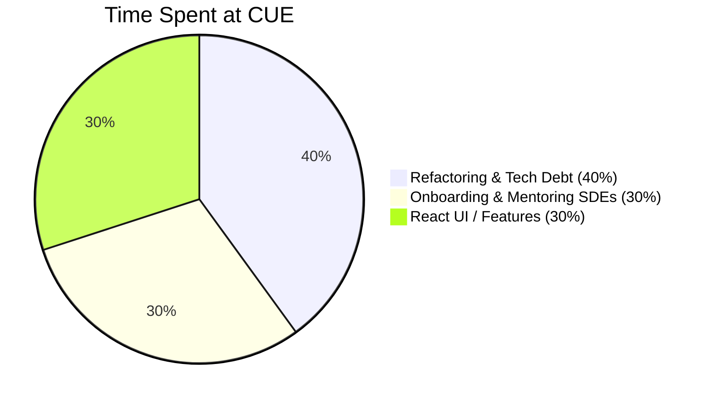

# CUE Post-Mortem


>  "I would certainly appreciate and will solicit your input on who we should be keeping around... I think that you are seeing the opportunity of being this very senior person [and] the advocate for tech debt on the team ... great talk, I feel like I learned a ton, so thank you for that -- I feel like I've been educated quite a bit, and this is exactly the kind of thing I want to get out of these kinds of conversations." [during a 1-on-1] 

— 🗣 [Bobby Wayne](https://www.linkedin.com/in/bobbywayne/), VP, Software Development at Cue Health `Aug 17, 2022` 


>  "Karl, a dev like you would be wanted anywhere. Thank you for all the help and mentorship. I learned a lot from you and already seen how much I've grown as an engineer, that's all thanks to you."

— 🗣 [Karun Narayan](https://www.linkedin.com/in/karun-narayan/), SDE at Cue `Oct 6, 2022` 


# **Table of Contents**

- [🕙 How I Spent My Time](https://github.com/charlieargue/CUE-code-samples#-how-i-spent-my-time)
- [💻 Code Samples](https://github.com/charlieargue/CUE-code-samples#-code-samples)
- [🗣 Testimonials and Feedback](https://github.com/charlieargue/CUE-code-samples#-testimonials-and-feedback)
- [⭐️ UI Features / Highlights](https://github.com/charlieargue/CUE-code-samples#️-ui-features--highlights)


# 🕙 How I Spent My Time




# Code Samples


### RTK-Q Refactoring Journey

- show ==hooks== WITHOUT RTK-Q 👎 BEFORE & 👍 AFTER: 
- RTK-Q: show my typescript ==builder pattern==, yes!
- RTK-Q: big ==live visit one== (just after, yes I think! it'll be sanitized!)
- Account Profile.tsx (see below)
- show "what we were able ==to remove==", and maybe show as an example, one of the bad FILES we were entirely able to remove, like LV or something :), show some ==screen grabs of the GITHUB removal RED tags!!!!==💎
- show the ==useEffects== we removed!
- Show 👎 BEFORE & 👍 AFTER: `setUnreadMessages` b/c now using ==React.Context== here below


# State Mngmnt / RTK-Q and React.Context REFACTORING BEFORE & AFTER:

- [ ] **React.Context:** 👎 BEFORE & 👍 AFTER: 

  - [ ] ```js 
    EVERY LITTLE THING!
    👎 BEFORE & (for real! it almost looks like a joke ;)
    // setUnreadMessages: (state) => {
            //     if (state.twilioModal) {
            //         return {
            //             ...state,
            //             twilioModal: {
            //                 ...state.twilioModal,
            //                 unreadMessages: true,
            //             },
            //         };
            //     }
            // },
      
      
      
      👍 AFTER: 
    
    case 'setUnreadMessages': {
      return { ...state, unreadMessages: true };
    }
    ```


# POKAZ: `Account Profile.tsx` and containers

**Before:**

* lots of selectors and everything in REDUX
* State over-complicated and stored twice (in Formik state and again in Redux)
* lots of `useEffects` making it hard to reason about this component, esp. for new React engineers
```js
// 👎 BEFORE: 
const AccountProfileContainer: FC = () => {
    const dispatch = useAppDispatch();
    const profile = useSelector(selectProfileData);
    const isProfilePending = useSelector(selectIsProfileStatusPending);
    const isUpdateProfilePending = useSelector(selectIsUpdateProfileStatusPending);
    const isUpdateProfilePicturePending = useSelector(selectIsUpdateProfilePictureStatusPending);
    const pracititionerFHIRResource = useSelector(selectPractitionerFHIRResource);
    const usStates = useSelector(selectStatesAbbreviation);
    const isUSStatesPending = useSelector(selectIsStatesStatusPending);
    const i18nConfig = useSelector(selectConfigData);
    const [formData, setFormData] = useState<AccountProfileFormValues>({
        firstName: '',
        middleName: '',
        lastName: '',
        email: '',
        type: AuthTypes.UserType.Home,
        phoneType: null,
        phoneNumber: '',
        zipCode: '',
        city: '',
        birthDate: '',
        stateOfResidence: '',
        prefix: '',
        suffix: '',
        picture: '',
        fax: '',
        address: '',
    });

    useEffect(() => {
        dispatch(fetchProfile({}));
        dispatch(fetchStates());
        dispatch(fetchConfig());
    }, []);

    useEffect(() => {
        if (!profile) return;
        if (profile.practitionerId) {
            dispatch(practitionerThunks.fetchById(profile.practitionerId));
        }
        setFormData({
            ...formData,
            ...profileToAccountProfileFormValues(profile),
        });
    }, [profile]);

    useEffect(() => {
        if (!pracititionerFHIRResource) return;
        setFormData({
            ...formData,
            ...practitionerToAccountProfileFormValues(pracititionerFHIRResource),
        });
    }, [pracititionerFHIRResource]);
  
  // ....
```

**PLUS all these REDUX plumbing <u>files</u> , totally HUNDREDS and often thousands of lines of code:**

1. 🧩 actions (AsyncThunk)

2. 🧩 api fetchers functions

3. 🧩 selectors

4. 🧩 state slices

5. 🧩 reducers

   


**After:**

* no selectors
* no extra redundant state, Formik handles everything
* no extra `useEffects` 
* all 🧩 REDUX plumbing files **deleted**!

```js 
// 👍 AFTER: 
const AccountProfileContainer: FC = () => {
    const dispatch = useAppDispatch();
    const [triggerAddPractitioner] = practitionerApi.useAddMutation();
    const [triggerEditPractitioner] = practitionerApi.useEditMutation();
    const [triggerEditUser, { isLoading: isLoadingUser }] = useEditUserMutation();
    const [triggerEditUserPicture, { isLoading: isLoadingUserPicture }] = useEditUserPictureMutation();
    const [triggerWriteSignedUrl, { isLoading: isLoadingWriteSignedUrl }] = useWriteSignedUrlMutation();

    const { data: stateList, isLoading: isLoadingStates, isFetching: isFetchingStates } = useFetchStatesQuery();
    const usStates = (stateList || []).map(({ abbreviation }) => abbreviation);
    const { data: profile, isLoading: isLoadingProfile } = useGetMeQuery();
    const { data: i18nConfig, isLoading: isLoadingConfig, isFetching: isFetchingConfig } = useFetchConfigQuery();
    let pracArgs: typeof skipToken | string = skipToken;
    if (profile?.practitionerId) {
        pracArgs = profile?.practitionerId;
    }
    const {
        data: fhirPractitioner,
        isLoading: isLoadingPractitionerFHIR,
        isFetching: isFetchingPractitionerFHIR,
    } = practitionerApi.useFetchByIdQuery(pracArgs);

    const isLoading =
        isLoadingStates ||
        isFetchingStates ||
        isLoadingProfile ||
        isLoadingPractitionerFHIR ||
        isFetchingPractitionerFHIR ||
        isLoadingConfig ||
        isFetchingConfig;

    if (isLoading) {
        return <>Loading...</>;
    }

		// ...
```


- [ ] POKAZ: the <DataFilters> and `<DataFiltersNew>`
- [ ] POKAZ: the Live Visit container lol and after with RTK-Q :) ==and simpler visit history?==
- [ ] SEE: [Code-RTK-Q-allowed-us-to-DECOMISH.md](/Users/karlgolka/PROJECTS/FYI/_Employers/Cue Health/__POCs/POC-2-RESULTS-✅/Code-RTK-Q-allowed-us-to-DECOMISH.md)

- [ ] break up into files
- [ ] ==STYLE-GUIDE!!!==
- [ ] YES: show the one with 7 useEffects LV, right?
- [ ] YES:  before and after?

search here: 

https://www.loom.com/share/cd0eafe654e54a539859d034da8a0e50 (24 minutes in is ==Before.tsx==)

- [ ] VIP! must show this! it's sanitized I think, check it again! Super nice :) https://www.loom.com/share/cfa602e0bbc74e949d9a00efe4d2971e RTKQ Kick-off of my 749 epic ... == and shows my style-guide==


### Sample #1 - Showing the POC - Phase #1

==clean this up==

```js 
// THX: https://redux-toolkit.js.org/rtk-query/usage/migrating-to-rtk-query#custom-hook
import { R4 } from '@ahryman40k/ts-fhir-types';
import { useEffect } from 'react';
import { useSelector } from 'react-redux';
import { useAsyncEffect } from '../../../lib/use-async-effect';
import { thunks as thunksDiagReport } from '../../../modules/fhir/store/diagnostic-report/diagnostic-report-entity-adapter.slice';
import { thunks as thunksObservation } from '../../../modules/fhir/store/observation/observation-adapter.slice';
import { thunks as thunksPatient } from '../../../modules/fhir/store/patient-entity-adapter.slice';
import {
    patientObservationIdsSelector,
    patientObservationsSelector,
} from '../../../modules/patient/store/common/selectors';
import { actions as PatientUICommonActions } from '../../../modules/patient/store/common/slice';
import {
    queryPendingSelector as queryPendingTestDetailsSelector,
    selectedTestDetailsSelector,
} from '../../../modules/patient/store/test-details-ui/test-details-ui.selectors';
import { actions as TestDetailsUIActions } from '../../../modules/patient/store/test-details-ui/test-details-ui.slice';
import { dispatch } from '../../../store';
import { AsyncStatus } from '../../../types/AsyncStatus';

// ##################################################################################
// USAGE:
//          // PATIENT ID + DIAGNOSTIC REPORT ID + OBSERVATION ID ▶ returns a SINGLE Diagnostic Report w/ an Observation spliced in
//          `const { testDetails, isUninitialized, isLoading, isError, isSuccess } = useFetchPatientTestDetailsQuery('123abc', '4d5e', 'o212312');`
//
// ##################################################################################
export function useFetchPatientTestDetailsQuery(
    patientId: string,
    diagRepId: string = null,
    observationId: string = null
) {
    const { setDiagReport, setPatient, setPatientId, setTestDetailsId } = TestDetailsUIActions;
    const data = useSelector(selectedTestDetailsSelector);
    const status = useSelector(queryPendingTestDetailsSelector);

    // testing selector
    const obzIds = useSelector(patientObservationIdsSelector);
    const obz = useSelector(patientObservationsSelector);
    console.log(`🚀 ~ CUSTOM HOOK: obzIds`, obzIds);
    console.log(`🚀 ~ CUSTOM HOOK: obz`, obz);

    useEffect(
        useAsyncEffect(async () => {
            if (!patientId || !observationId || !diagRepId) return;

            // set Ids
            dispatch(PatientUICommonActions.setPatientId(patientId)); // 🛑  TODO: TBD: I need to actually read this Patient, instead of using my unnecessary setPatient below, afaik)
            dispatch(setPatientId(patientId));

            // fhir requests
            const fhirDiagReports = await dispatch(thunksDiagReport.query([`Patient/${patientId}`])).unwrap();
            const fhirObservation = await dispatch(thunksObservation.fetchById(observationId)).unwrap();
            const fhirPatient = await dispatch(thunksPatient.fetchById(patientId)).unwrap();

            // just need one diag report (NOTE: couldn't get thunkDiagReport.findById to work (validation error, iirc))
            const diagReport = fhirDiagReports.find((dr: R4.IDiagnosticReport) => dr.id === diagRepId);

            // set IDs
            dispatch(setTestDetailsId((fhirObservation as any).id));
            dispatch(setDiagReport(diagReport));
            dispatch(setPatient(fhirPatient as unknown as R4.IPatient));
        }),
        [dispatch, observationId, patientId, diagRepId]
    );

    const isLoading = status === AsyncStatus.Pending || status === AsyncStatus.Void;
    const isUninitialized = status === AsyncStatus.Void;
    const isError = status === AsyncStatus.Rejected;
    const isSuccess = status === AsyncStatus.Fulfilled;

    return {
        data,
        isUninitialized,
        isLoading,
        isError,
        isSuccess,
    };
}
```


## Phase 2 - RTK-Q

```JS 
import { R4 } from '@ahryman40k/ts-fhir-types';
import { skipToken } from '@reduxjs/toolkit/query/react';
import keyBy from 'lodash/keyBy';
import * as React from 'react';
import { ReactText, useState } from 'react';
import { useParams } from 'react-router-dom';
import { unbundle } from '../../../fhir/be-api-common';
import { BundleResourceQuery } from '../../../fhir/query';
import { diagnosticreportApi, observationApi, ObservationQuery } from '../../../fhir/query-store';
import PatientTestHistory from '../../components/PatientTestHistory/PatientTestHistory';
import { diagnosticReportToTestHistory, pluckObsId } from '../../fhir-mappers/test-history.mapper';
import { TestHistory } from '../../models/test-history';

export const PatientTestHistoryContainer: React.FC = () => {
    const { id: patientId } = useParams<{ id?: string }>();
    const [selectedRowsKeys, setSelectedRowsKeys] = useState<ReactText[]>([]);

    // ##################################################################################
    // DIAGNOSTIC REPORTS (test history)
    // ##################################################################################
    const {
        data: fhirDiagnosticReports,
        isLoading: isLoadingDiagnosticReports,
        isFetching: isFetchingDiagnosticReports,
    } = diagnosticreportApi.useQueryQuery({
        subject: `Patient/${patientId}`,
    });

    // ##################################################################################
    // OBSERVATIONS (test details)
    // ##################################################################################
    type obsBundleType = BundleResourceQuery<ObservationQuery>[];
    const observationIds = fhirDiagnosticReports?.map((dr) => pluckObsId(dr.result));
    const uniqueObservationIds = [...new Set(observationIds)];

    let testHistory;
    let obsArgs: typeof skipToken | obsBundleType = skipToken;
    if (uniqueObservationIds?.length) {
        obsArgs = uniqueObservationIds?.map(
            (id): BundleResourceQuery<ObservationQuery> => ({
                kind: 'fetchById',
                id,
            })
        );
    }
    const {
        data: fhirObsBundle,
        isLoading: isLoadingObs,
        isFetching: isFetchingObs,
    } = observationApi.useBundleQuery(obsArgs);
    if (fhirObsBundle?.length) {
        const fhirObs: R4.IObservation[] = fhirObsBundle?.map(unbundle).filter(Boolean) || undefined;
        const entitiesObs = keyBy(fhirObs, 'id');
        testHistory = fhirDiagnosticReports?.map((dr) => {
            const obsId = pluckObsId(dr.result);
            const foundObs = entitiesObs[obsId];
            return foundObs ? diagnosticReportToTestHistory(dr, foundObs) : [];
        });
        // NOTE: apparently there are cases where multiple DRs will have the SAME DATE, and we should just take one of those (unsorted is OK, as these are just test records afaik)
        const dateMap = keyBy(testHistory, 'dateCompleted');
        testHistory = Object.keys(dateMap).map((id) => dateMap[id]);
    }

    const isLoading = isLoadingDiagnosticReports || isFetchingDiagnosticReports || isLoadingObs || isFetchingObs;

    if (isLoading) {
        return <>Loading...</>;
    }

    return (
        <PatientTestHistory
            testHistories={testHistory as TestHistory[]}
            downloadCartridgePdf={null}
            downloadAllCartridgePdf={null}
            downloadCartridgeCsv={null}
            downloadAllCartridgeCsv={null}
            testTotalElements={testHistory?.length}
            testPageSize={null}
            testPage={null}
            testPageChangeRequested={null}
            selectedRowsKeys={selectedRowsKeys}
            setSelectedRowsKeys={setSelectedRowsKeys}
            loading={isLoading}
            patientId={patientId}
        />
    );
};
```


# ==AT END/BOTTOM plz==

# ⭐️ UI Features / Highlights

- Show test history
- test details
- Patient search page
- skeletons movie


# 📚 Resources for Hi-Productivity and DX

- [Typora](https://typora.io/) for editing markdown files 
- a [GitHub](https://github.com/) personal knowledge base 
- [Bookmarks Extension](https://marketplace.visualstudio.com/items?itemName=alefragnani.Bookmarks) for VS Code
- [Loom](https://loom.com/) for sharing and making sure I don't miss anything
- [CODDX](https://marketplace.visualstudio.com/items?itemName=coddx.coddx-alpha) personal Kanban board for VS Code


# ==🔘🔘🔘🔘🔘🔘🔘🔘🔘🔘🔘🔘🔘🔘🔘🔘🔘🔘🔘🔘== 

# ==IDEAS and SCRATCH==


.png)


