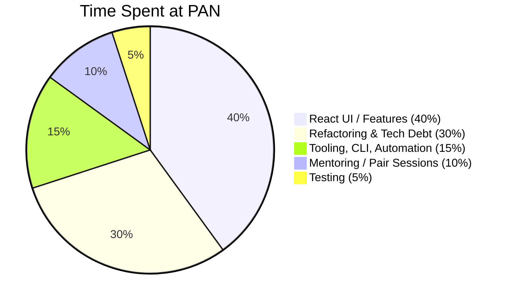

# CUE Code Samples


"As far as coding, your credentials are extremely high, I mean, there's not much I can teach you... if anything, I'm probably gonna have to learn from you..." [during 1-on-1 performance review] 

— 🗣 *[Mazen Ghalayini](https://www.linkedin.com/in/mazen-g-a76139179/)* `Feb 15, 2022`  🔉 **[Audio Clip 1](https://github.com/charlieargue/pan-code-samples/issues/4)** 


# State Mngmnt / RTK-Q and React.Context REFACTORING BEFORE & AFTER:

- [ ] **React.Context:** 👎 BEFORE & 👍 AFTER: 
  
  - [ ] ```js 
    EVERY LITTLE THING!
    👎 BEFORE & (for real! it almost looks like a joke ;)
    // setUnreadMessages: (state) => {
            //     if (state.twilioModal) {
            //         return {
            //             ...state,
            //             twilioModal: {
            //                 ...state.twilioModal,
            //                 unreadMessages: true,
            //             },
            //         };
            //     }
            // },
      
      
      
      👍 AFTER: 
    
    case 'setUnreadMessages': {
      return { ...state, unreadMessages: true };
    }
    ```


# ✅ Tasks: 

- [ ] POKAZ: `Account Profile.tsx` and containers
- [ ] POKAZ: the <DataFilters> and `<DataFiltersNew>`
- [ ] POKAZ: the Live Visit container lol and after with RTK-Q :) ==and simpler visit history?==


🔘🔘🔘🔘🔘🔘🔘🔘🔘🔘🔘🔘🔘🔘🔘🔘🔘🔘🔘🔘 


# **Table of Contents** 

- [🕙 How I Spent My Time](#-how-i-spent-my-time)
- [💻 Code Samples](#-code-samples)
- [🎦 Demos and Videos Samples](#-demos-and-videos-samples)
- [⭐️ UI Features / Highlights](#%EF%B8%8F-ui-features--highlights)
- [🗣 Testimonials and Feedback](#-testimonials-and-feedback)
- [📚 Other Resources](#-other-resources)
- [🔗 Other Code Samples](#-other-code-samples)


# 🕙 How I Spent My Time



# 💻 Code Samples

| <u>Terminology</u>:                           |                                                              |                             |                                  |
| --------------------------------------------- | ------------------------------------------------------------ | --------------------------- | -------------------------------- |
| `RTK` <br />*Redux ToolKit* (Redux basically) | `RTK-Q`<br /> *Redux ToolKit - Query* <br />(data fetching, cache management) | `MFE`<br />*Micro-Frontend* | `msw`<br />*Mock Service Worker* |


### RTK-Q API, Endpoints, and Auto-Generated Hooks

*  [Example #1](code-samples/rtkq/api-endpoints-and-hooks.md)

### RTK-Q Builders 

* [Example #1](code-samples/rtkq/builders/example-1.md) (Get Pending Assets)
* [Example #2](code-samples/rtkq/builders/example-2.md) (Start Transfer)

### RTK-Q Cache Updates

* [Pessimistic Example](code-samples/rtkq/cache-updates/pessimistic.md)
* [Optimistic Example](code-samples/rtkq/cache-updates/optimistic.md)

* [General (from Component) Example](code-samples/rtkq/cache-updates/general.md) 

### Component Examples:

* [License "Temperature Gauges"](code-samples/components/temperature-gauges.md) (simple)
* [Incoming Popover](code-samples/components/incoming-popover.md) (simple)
* [Expiration Extension CTA](code-samples/components/IEECTA.md) (with **react-query** and **Jest** unit tests)
* [Transfer Asset Drawer](code-samples/components/transfer-asset-drawer.md) (more complex, with **StoryBook** & **Cypress** testing)

### Other Javascript Examples

* ["Fetcher" Service based on `fetch`](code-samples/javascript/fetch.md) 
* ["Fetcher" Service based `axios`](code-samples/javascript/axios.md) (for `RTK-Q`)

### POC / Spike Story Examples

- [ctx-options ("Context Options") ](https://github.com/charlieargue/ctx-options) repo I made showing patterns for avoiding **React Context** "over-rendering" and state management


### Mocked API Server Examples

- [`msw` and `@mswjs/data`](code-samples/msw/msw.md) 

### Cypress Integration Tests

- [E2E tests and tooling](code-samples/cypress/e2e.md)


### CLI & Tooling Examples

- [token.js](code-samples/CLI-tooling/token.md) - automates repetitive daily developer chores
- [msw.js](code-samples/CLI-tooling/msw.md) - initializes and bootstraps `msw`  for any `MFE`


# 🎦 Demos and Videos Samples

- [MSW Overview Video](https://github.com/charlieargue/pan-code-samples/issues/1) (<2 min)
- [29 Cypress E2E](https://github.com/charlieargue/pan-code-samples/issues/2) tests running against `msw` (3.5 min)
- [Demo of Asset Transfer Flows](https://github.com/charlieargue/pan-code-samples/issues/3) (before loading animations/skeletons were added)


# ⭐️ UI Features / Highlights


**Popover Samples:** Incoming, Outgoing, and Rejected

|  |  |
| ------------------------------------------------------------ | ------------------------------------------------------------ |
|  |  |


# 🗣 Testimonials and Feedback

`Mazen Ghalayini` — Staff React Engineer, Direct Supervisor ([LinkedIn](https://www.linkedin.com/in/mazen-g-a76139179/), mghalayini@paloaltonetworks.com)

`Hanford Choy` — Non-Technical Project Manager (hchoy@paloaltonetworks.com)

`Alexander Jones` — Team Head Designer ([LinkedIn](https://www.linkedin.com/in/alexander-jones7/), aljones@paloaltonetworks.com)

`Palak Mehrotra` — Senior Software Engineer ([LinkedIn](https://www.linkedin.com/in/palakmehrotra/))

`Veerendra Vundavalli`  — .NET & React (+Native) Developer ([LinkedIn](https://www.linkedin.com/in/veerendravundavalli/))


### Feedback after Demo 

 `Jan 21, 2022` (*from #slack*)

|  |  |
| ------------------------------------------------------------ | --------------------------------------- |


### Feedback from Supervising Staff Engineers


> "As far as coding, your credentials are extremely high, I mean, there's not much I can teach you... if anything, I'm probably gonna have to learn from you..." [during 1-on-1 performance review] 
>
> — 🗣 *[Mazen Ghalayini](https://www.linkedin.com/in/mazen-g-a76139179/)* `Feb 15, 2022`
>
> 🔉 **[Audio Clip 1](https://github.com/charlieargue/pan-code-samples/issues/4)** 


> "I think this is excellent work, I think we're moving at a really good pace." [<u>re:</u> MFE refactoring and eliminating tech debt] 
> — 🗣 *[Mazen Ghalayini](https://www.linkedin.com/in/mazen-g-a76139179/)*  `Jan 4, 2022`
>
> 🔉 **[Audio Clip 2](https://github.com/charlieargue/pan-code-samples/issues/5)** 


> "I love what you did with puppeteer." [<u>re:</u> automating MFE token authentication] 
> — 🗣 *[Mazen Ghalayini](https://www.linkedin.com/in/mazen-g-a76139179/)* `Dec 9, 2021`


> "It was a great effort on the MFE refactoring." 
>
> — 🗣 *[Mazen Ghalayini](https://www.linkedin.com/in/mazen-g-a76139179/)* `Jan 18, 2021`


> "Alright, let's give it a shot!" [<u>re</u>: adopting my idea for a shared Postman collection between FE and BE teams] 
>
> — 🗣 *[Mazen Ghalayini](https://www.linkedin.com/in/mazen-g-a76139179/)*  `Feb 22, 2022`


> "... [unlike other engineer, whose PR's are] total rewrites sometimes... yours so far have been very good, I've only needed to do CSS-stuff [minor things]... keep [doing] what you're doing, you're doing good... you've definitely like learned a lot about how we do things, and you probably now have a really good grasp of how things work... you've been doing great... so just continue to do that, that's great [<u>re:</u> my successful team adoption efforts]... " [during 1-on-1 performance review] 
>
> — 🗣 *[Mazen Ghalayini](https://www.linkedin.com/in/mazen-g-a76139179/)*  `Feb 15, 2022`


> "...you know, also, ... we're kind of under siege from [a lot of directions]... so yeah, I think your suggestion is a good one that we need to try..."  [<u>re</u>: to seriously consider GraphQL as an option] 
>
> — 🗣 *[Vish Ramamurthy](https://www.linkedin.com/in/veerendravundavalli/)*  `Feb 23, 2022`


> "You're doing better than all the other people that I onboarded. I'm the first UI developer [on this Rewrite Team], and then it was two others, and a third one, ... two got kicked out, one is still with us, and you are the last one now! ... In my opinion, you definitely are showing the right attitude, and I'm getting the right signals from others... and if you need me to vouch for you, I'm going to give them the thumbs-up... and so far I think you're doing good because I get a pretty good impression from someone higher than me.... he's said good things about you, so keep it up, and you'll get recognized... and hired... I think you'll definitely get there, and it'll be good for Palo Alto, I mean you're a very good candidate for them!" [<u>re:</u> converting from contractor to full-time employment]." 
> — 🗣 *[Mazen Ghalayini](https://www.linkedin.com/in/mazen-g-a76139179/)*  `Dec 8, 2021` 


### Feedback from Project Management

> "BTW, I gave you the most exciting feature that I believe will be used by a lot of customers :)."  
>
> — 🗣 *Hanford Choy*,  `Feb 1, 2022`


> "Karl, [epic] looks really good. Congrats! I could not find any issues, and closed this ticket."
>
> — 🗣 *Hanford Choy*,  `Dec 7, 2021`
>
> 

### Feedback from Designer

> "You're selling it, that's exactly what I'm looking for!" [re: toast notifications, popover messaging, and row highlighting proposals] 
>
> — 🗣 *[Alexander Jones](https://www.linkedin.com/in/alexander-jones7/)*  `Feb 23, 2022`


### Feedback from BE/FE Team

> "I agree with Karl, actually." [<u>re</u>: my clarifying Big Query vs MySQL confusion on Asset Transfer epic] — 🗣 *Palak Mehrotra*  `Feb 23, 2022`


> "Thanks to Mazen and Karl for all their help on UI and Artifactory setup" 
>
> — 🗣 *[Veerendra Vundavalli](https://www.linkedin.com/in/veerendravundavalli/)*  `Feb, 2022`


# 📚 Other Resources

- [Impact on Team](Impact.md)
- [MBP "Setup Cheatsheet"](other/mbp-setup-cheatsheet.md)
- Sample [Design Document](other/design-doc.md)
- Example of [Clear Communication](other/JIRA-clear-communication.md) (in JIRA)
- [Javascript libraries](other/libraries.md) I Introduced
- 📊 [Flowcharts and Diagrams](other/flowcharts-diagrams.md)


# 🔗 Other Code Samples

Not related to Palo Alto Networks:

- https://github.com/charlieargue/multi-cart#-code-samples (React • GQL • Serverless)
- https://github.com/charlieargue/multi-cart-pg (React • GQL • PERN stack + Typescript)
- https://github.com/charlieargue/multi-cart-MRP-containers (Minimum Reproducible Project) 
  - made while trouble-shooting my GitHub Actions `.yml` script
  - helped me successfully run Cypress E2E specs across multiple machines in parallel 
  - helped in fixing CICD `yarn` and `npm` caching issues
- https://github.com/charlieargue/clickup-july-table (Successfully-passed Angular Interview take-home test for [ClickUp.com](https://clickup.com/))


# ✉️ Contact Me

My personal website is https://karlgolka.com/ and you can email me at contact@karlgolka.com 

